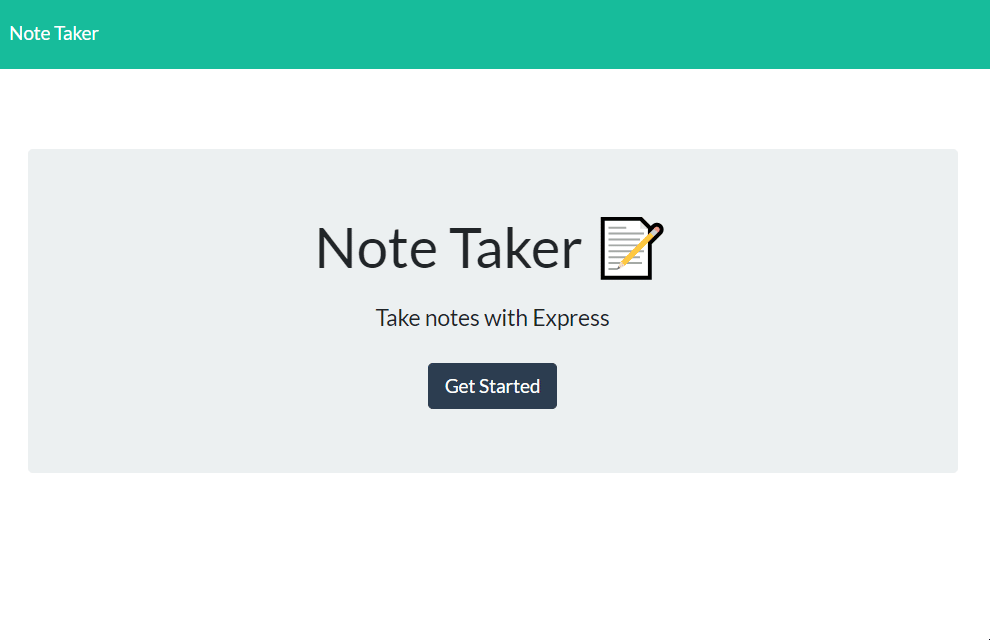

# Express.js - Note Taker Application

## Description
A note taker application that can be used to write and save notes. The application uses an Express.js back-end, and saves and retrieves note data from a JSON file.
  
## Table of Contents
- [Installation](#installation)
- [Usage](#usage)
- [Credits](#credits)
- [License](#license)

## Installation
N/A

## Usage 
Application deployed at the following link: https://thawing-everglades-37021.herokuapp.com/

When opening the link above, the user will be presented with a landing page for the application. When the user clicks on the "get started" link, they are presented with a page with existing notes listed in the left-hand column, plus empty fields to enter a new note title and the note’s text in the right-hand column. When the user enters a new note title and text in the application, a save icon will appear in the navigation bar at the top of the page. The user can then click that icon in order to save the note to the application, and will appear with the other saved notes on the left. If a user wants to view one of their saved notes, they can click on it, and it will appear on the main column. If the user wants to add a new note after viewing an old note, they can click on the plus button on the top to be presented with a blank text input boxes. Finally, if the user wishes to delete a saved note, they can click on the trash button on that note, and it will delete from the application.

## Credits
While working on this project, I worked alongside Jackson Myhre and Roy Logan in the same bootcamp class. And used the following libraries and packages:
- [node.js](https://nodejs.org/en/)
- [express.js](https://www.npmjs.com/package/express)
- [uuid](https://www.npmjs.com/package/uuid)

## License
Licensed by The Unlicense
